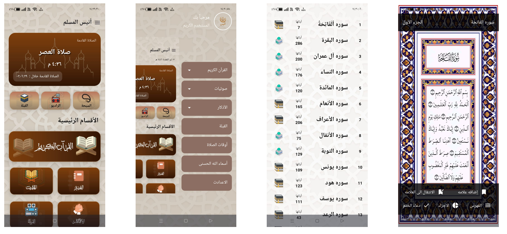
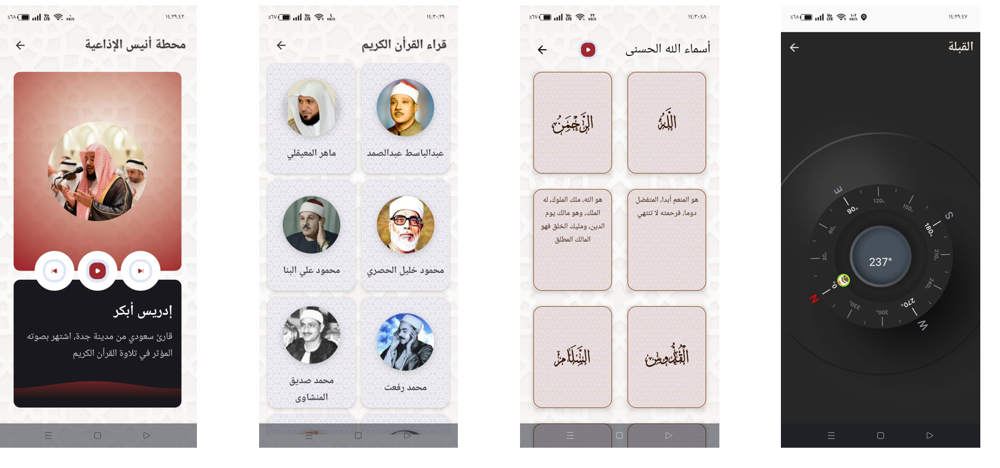

# Anees - Your Islamic Companion

**Anees** is a comprehensive Islamic app designed to provide a seamless spiritual experience for Muslims, offering a variety of features to help with daily worship and learning.

## 🌐 Features

**Anees** offers a wide range of essential Islamic tools and services in one smooth, unified experience:

- 📖 **Qur'an Reading** – Access the full Quran with clear layout and usability.
- 🔊 **Qur'an Audio** – Listen to recitations from over 10 renowned Qaris.
- 📚 **Tafsir** – Understand the meanings of verses with rich and reliable tafsir sources.
- 🕋 **Qibla Direction** – Accurate Qibla compass to help you pray in the right direction.
- 🕌 **Prayer Times & Alarms** – Stay notified about prayer times with customizable alarms.
- 🟢 **Azkar** – Includes morning, evening, and general adhkar collections.
- 🧮 **Digital Tasbeeh** – A beautiful, responsive counter for daily dhikr and tasbeeh.
- 📜 **Hadith** – Browse a curated collection of authentic Hadiths.
- 📻 **Islamic Radio** – Stream Quran recitations, Ruqyah, fatwas, and more from top stations.
- 🔔 **Smart Notifications** – Daily reminders for prayers, adhkar, and more.

### 🌐 **Technologies**
- **Language:** Kotlin  
- **UI:** Jetpack Compose  
- **Architecture:** MVVM (Model-View-ViewModel)  
- **Asynchronous Programming:** Kotlin Coroutines  
- **Networking:** Retrofit  
- **Database:** Room (for Sebha), SharedPreferences  
- **Data Formats:** PDF, JSON  
- **Alarm System:** Android AlarmManager, WorkManager  
- **Services & Broadcasts:** Foreground Service, BroadcastReceiver  
- **Dependency Injection:** Hilt  
- **Media:** ExoPlayer, MediaPlayer  
- **Animations:** Lottie (for splash screen)

### 🌐 **APIs Used**

**Anees** integrates with the following APIs to provide a rich experience:

- **Quran Sounds API**: For streaming recitations from various Qaris.  
  - [Quran Reciters API](https://www.mp3quran.net/api/v3/reciters?language=ar)
  
- **Hadith API**: For fetching authentic Hadith collections.  
  - [Hadith API](https://api.hadith.gading.dev/)  
  - [Specific Hadith Example](https://cdn.jsdelivr.net/gh/fawazahmed0/hadith-api@1/editions/ara-bukhari/52.json)

- **Radio Sound API**: For streaming Islamic radio stations, including Quran recitations and more.  
  - [Radio API](https://www.mp3quran.net/api/v3/radios?language=ar)

### 👥 **Team Members**

**Anees** is a project developed by a passionate team:

- **abdelazizmaher17499@gmail.com** 
- **alikotb38@gmail.com**
- **abdokamel8886@gmail.com**
### 📸 **Screenshots**

Add screenshots of the app here to give users a preview of the UI:

  
  
  

### 🎥 **Video**

[Watch the demo video](path_to_video_url)

## 🛠 **Setup and Installation**

To get started with **Anees**, follow these steps:

1. **Clone the repository**:
   ```bash
   git clone <repository-url>
   ```

2. **Open the project** in Android Studio.

3. **Install dependencies**:
   - Make sure you have the required SDK versions.
   - Sync the project with Gradle to download necessary dependencies.

4. **Run the app**:
   - Select your preferred device or emulator.
   - Click "Run" in Android Studio.

## 📋 **Additional Notes**

- **Languages Supported**: Currently, **Anees** supports the Arabic language with plans to add more languages in the future.
- **Known Limitations**:  
  - Offline features are limited to specific content (some Hadiths, Qur'an parts, Azkar, and Tasbeeh).  
  - The app requires an active internet connection for certain functionalities like streaming radio and live notifications.
  
- **Future Improvements**:  
  - Multi-language support  
  - Enhanced offline mode for more content

## 📝 **Contributing**

If you would like to contribute to **Anees**, feel free to fork the repository and submit a pull request. We welcome any improvements, bug fixes, and new features!

## 🔗 **Contact**

For any questions, issues, or suggestions, feel free to reach out to the developers on LinkedIn:

- [Abdelrahman Kamel](https://www.linkedin.com/in/abdelrahmankamel00)  
- [Abdelaziz Maher](https://www.linkedin.com/in/abdelaziz-maher-9985b2229)  
- [Ali Kotb](https://www.linkedin.com/in/alikotb/)
---

**End of README**
